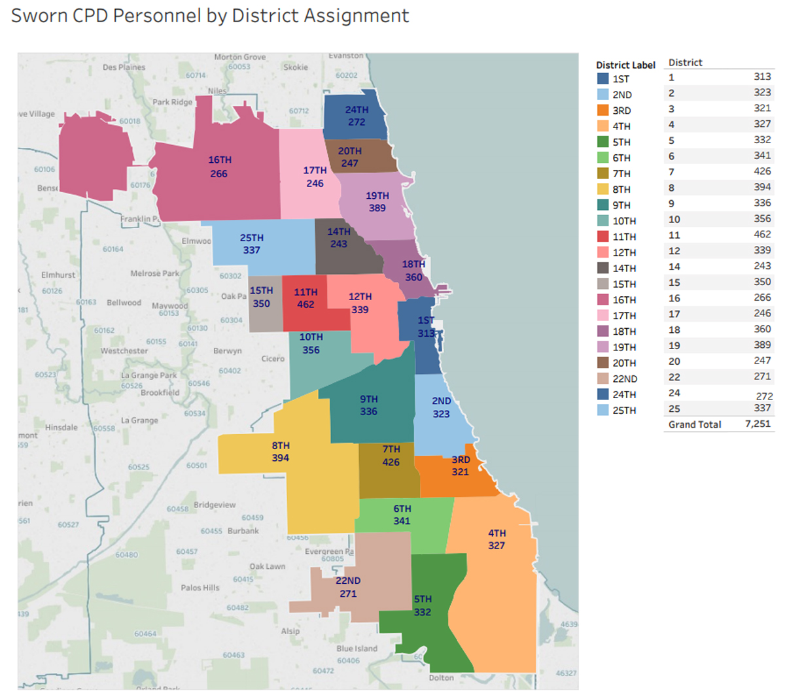

```{r setup, include=FALSE}
knitr::opts_chunk$set(echo = FALSE, cache = TRUE, warnings = FALSE)
```

The last 10 days in Chicago politics and law enforcement has been a lot.  The Van Dyke trial was a diffcult moment for the city.  Conversations about the impact of the decision on young Black men, cops, families, the courts, the police department, activists, and politicians were running hot.

While I've had brief conversations with police and criminology experts, I'm no expert.  In these situations I try to listen.  After processing the verdict, I finally got around to reading the multi-part reporting done by the [Invisible Institute](https://invisible.institute/) for The Intercept.  [The Chicago Files](https://theintercept.com/series/the-chicago-police-files/) is a series about the shooting of Laquan McDonald and the larger problems in the Chicago Police Department.  What's was exciting to me about this piece, and what I hadn't realized, is that they were able to use the Freedom of Information Act (FOIA) to obtain a tremendous amount of data from the Chicago Police Department!

<!-- Having gotten a breather from the campaign, I was able to finally dig into the Invisible Institute's data.   -->
While I've got a couple of interesting points to make, the larger point that I want to make is that our city's data is powerful.  Part of the reason that I'm running for city council is so that I can spend more time and have more access to working with this kind of municipal data.

For example, the county's [property tax assessments](https://features.propublica.org/the-tax-divide/cook-county-commercial-and-industrial-property-tax-assessments/) have been done according to the whims of Cook County Assessor Joe Berrios and politically connected property tax attorneys.  The tax burden has been passed from corporations and our wealthy neighbors to minority and low-income households.  Another equally egregious example is the city's lead poisoning prediction algorithm.  It relies on private medical data to which only certain city employees have access.  [I suggested to the city's chief data officer, Tom Schenk](https://www.youtube.com/watch?v=FoYR3uz_qro#t=31m47s), that we could find out exactly how much impact water main replacements were having on childrens' lead levels using readily available data.  We've been **performing an experiment on our children** for the last 7 years.  We've done this by randomly replacing childrens' water mains and then giving the families no filters and little information.  Doing this analysis would be ground-breaking research for the public health community.  We've already done the experiment!  And yet, the city is totally uninterested in doing the analysis.  [I suspect this is politically motivated](https://troyhernandez.com/2017/06/15/lead-in-chicagos-water/).

That said, while huge sums of tax dollars and the health of our children deserve the public's interest, policing is a life and death issue.  So there may be no more important data set than the one I stumbled upon these last few days.

<!-- It's powerful because it's now widely available... and despite the current president's distaste for facts, I still believe in the power of facts.  Given the growing citizen (data) scientist this power will only increase. -->

# Laquan

Last Friday, I watched as a jury convicted Jason Van Dyke of 2nd degree murder and 16 counts of aggravated battery for shooting Laquan McDonald.  It was an emotional moment. A lot of people wanted to say something and a lot of people wanted to hear something.

Almost two decades ago I sat through a trial for a loved one that was killed in a hit and run homocide. The reading of the Van Dyke verdict unexpectedly brought back a lot of emotions, but it also reminded me of the emotional and intellectual maturity that one develops living through such an incident and the ensuing legal process.  I decided that I wanted to hear what the family had to say.  [Mauricio Pena's reporting](https://blockclubchicago.org/2018/10/05/laquan-mcdonalds-family-never-wanted-revenge-they-wanted-justice-uncle-says/) provided that:

> “All police are not bad,” he said. “I have police officers in my family, I have police officers that belong to this church.”

> But “let us never forget,” he added, that Van Dyke had 20 excessive force complaints against him. A functioning system would not allow that officer to continue serving, he said urging for a change to the Fraternal Order of Police contract to ensure justice.

> “Give the superintendent in the police department the power that he need to fire bad police officers,” he said.

> “Before the payout for Laquan McDonald, [Van Dyke] had already cost the city of Chicago over $500,000, and they never thought it to be a red flag to get rid of him,” he said.

Coming from a family that's been in Chicago for 4 generations, it shouldn't come as a surprise that I also have Chicago police officers in my extended family.  As I've gotten older, cops have become friends and neighbors.  I know police are not all bad.  But I also grew up sometimes-poor in an upper-middle class school district and played in [a hippie jam band](www.troyhernandez.com/music) touring the Midwest for 15 years.  Cops have not always been friendly.

# CPD

Jamie Kalven and the Invisible Institute did a tremendous amount of work FOIA'ing the Chicago Police Department's records.  Despite the Fraternal Order of Police working very hard to keep those records under wraps, multiple judges ruled that these records belong to the public.

Some of their findings were:

* [130 CPD officers account for 29% of police shootings](https://theintercept.com/2018/08/16/chicago-police-department-officer-involved-shooting/)
* [CPD is 14 times more likely to use force against black men than against white](https://theintercept.com/2018/08/16/chicago-police-misconduct-racial-disparity/)
* [Bad cops spread their misconduct like a disease](https://theintercept.com/2018/08/16/chicago-police-misconduct-social-network/)

It's great to have this data and hopefully this makes CPD change.  But none of this should come as a surprise to anyone that lives in the city or understands the social pressures for those in law enforcement.

Another great result of all of the Invisible Institute's work is the [Citizens Police Data Project](https://cpdp.co/) (CPDP).  If you go to that website you'll find a [Data link](https://data.cpdp.co/data/DR8KKN/citizens-police-data-project) at the top.

One thing that immediately stood out to me is the "Officers" section.  The graphic puts a lot of officers in the red, which represents an officer with 13 or more complaints.  As I poked around a bit more, I noticed that that spectrum of good and bad officers used only the number of complaints.  This is a mistake.  You can imagine a decent officer that serves for 26 years and gets a complaint every other year.  This would make them a typical member of CPD.  You can also imagine, if you've ever worked a service job, you're going to get occasional complaints.  This meme brought me back to my cashier days at UIC Hospital's parking garages.

```{r, out.width = "250px", fig.align="center"}

```

Police work is a service sector job that involves making people do things that they don't want to do. You're going to get some complaints.  So I wanted to dig into this a little more.

# Data

Let me be clear: The pattern of violence used by CPD needs to be addressed. This analysis is not meant to let CPD off of the hook.  This is only meant to provide a clearer analysis of how to go about addressing the problems in the department.

CPDP has made the [data](https://github.com/invinst/chicago-police-data) easily available to the public.  Poking around a little bit, I found the data that I needed to be able to analyze individual officers' complaint rates.

```{r}
library(knitr)
library(kableExtra)
dat <- read.csv("data/final-profiles.csv", stringsAsFactors = F)
complaints <- read.csv("data/complaints-accused.csv")
dat$appointed_date <- as.Date(dat$appointed_date)
dat$resignation_date <- as.Date(dat$resignation_date)
dat$resignation_date[which(is.na(dat$resignation_date))] <- Sys.Date()
dat$resignation_date <- as.Date(dat$resignation_date)
dat$time.on.job <- dat$resignation_date - dat$appointed_date

num.complaints <- rep(0, nrow(dat))
num.sustained <- rep(0, nrow(dat))

for(i in 1:nrow(dat)){
  num.complaints[i] <- length(which(complaints$UID == dat$UID[i]))
  num.sustained[i] <- sum(complaints[which(complaints$UID == dat$UID[i]),
                                     "final_finding"] == "SU")
}

dat$num.complaints <- num.complaints
dat$num.sustained <- num.sustained
bad.rows <- which(dat$org_hire_date == "")
bad.rows <- unique(c(bad.rows, which(dat$time.on.job < 0)))
dat2 <- dat[-bad.rows, ]

dat2$time.on.job <- dat2$resignation_date - dat2$appointed_date
dat2$complaints.per.year <- dat2$num.complaints / as.numeric(dat2$time.on.job) * 365.25
dat2$sustained.per.year <- dat2$num.sustained / as.numeric(dat2$time.on.job) * 365.25
```

As an example of the data that I used, let's look at some of Jason Van Dyke's data:

```{r}
Last.Name <- "VAN DYKE"
record <- dat2[which(dat2$last_name == Last.Name), c("first_name",
                                                     "middle_initial",
                                                     "last_name",
                                                     "birth_year", "race",
                                                     "gender", "appointed_date",
                                                     "resignation_date",
                                                     "num.complaints",
                                                     "num.sustained",
                                                     "complaints.per.year",
                                                     "sustained.per.year")]
kable_styling(kable(x = record, format = "html", digits = 2, row.names = FALSE),
              bootstrap_options = c("striped", "hover"))
```

Clearly he didn't resign today, this data is just a little old and he hadn't been found guilty yet.  For other officers still on the job, I have to put in today's date so I can calculate how long they've been working.  I use that and his 26 complaints to calculate an average of 1.5 complaints per year.

To make my initial point, here are some veteran cops that have fewer than the average number of complaints (`r round(mean(dat2$complaints.per.year, na.rm = TRUE), 2)` complaints per year), but have served for so long that they are in the CPDP's red zone:

```{r, cache = TRUE, echo = FALSE}
temp.dat <- head(dat2[which(dat2$num.complaints > 12 &
                              dat2$complaints.per.year < mean(dat2$complaints.per.year,
                                                              na.rm = TRUE)),
                      c("first_name", "last_name", "appointed_date",
                        "resignation_date", "complaints.per.year",
                        "sustained.per.year")])
kable_styling(kable(x = temp.dat, format = "html", digits = 2, row.names = FALSE),
              bootstrap_options = c("striped", "hover"))
```

Let's look at the distribution of complaints per year:

```{r}
complaint.dist <- quantile(dat2$complaints.per.year, seq(0, 1, .05), na.rm = T)
dist.vec <- t(complaint.dist)
# colnames(dist.vec) <- names(complaint.dist)
kable_styling(kable(x = dist.vec, format = "html", digits = 2),
              bootstrap_options = c("striped", "hover"))
```

The median officer gets `r round(complaint.dist[11], 2)` complaints per year.  The worst officer gets `r round(complaint.dist[21], 2)` complaints per year.  An officer gets a complaint, on average, every `r round(1 / mean(dat2$complaints.per.year, na.rm = TRUE), 1)` years.

To go the other way, here are some rookie cops that have only one or two complaints (putting them in CPDP's green rating), but their complaint rate puts them in the top 5% of complainees:

```{r}
library(kableExtra)
temp.dat <- head(dat2[which(dat2$num.complaints < 3 &
                              dat2$complaints.per.year > complaint.dist[20]),
                      c("first_name", "last_name", "appointed_date",
                        "resignation_date", "complaints.per.year",
                        "sustained.per.year")])
kable_styling(kable(x = temp.dat, format = "html", digits = 2,
                    row.names = FALSE),
              bootstrap_options = c("striped", "hover"))
```

Their complaint rate is so high because they were let go shortly after the complaint was made.  Certainly not model officers deserving of a green rating.

Let's check out the distribution of sustained complaints per year:

```{r}
sustained.dist <- quantile(dat2$sustained.per.year, seq(0, 1, .05), na.rm = T)
kable_styling(kable(x = t(sustained.dist), format = "html", digits = 2),
              bootstrap_options = c("striped", "hover"))
```

The median officer doesn't have a complaint.  An officer gets a sustained complaint, on average, every `r round(1 / mean(dat2$sustained.per.year, na.rm = TRUE))` years.

### Police Units and Districts

Part 5 of The Intercept series, [Bad cops spread their misconduct like a disease](https://theintercept.com/2018/08/16/chicago-police-misconduct-social-network/), highlights disparities between clusters of cops.

> Officers [linked to other officers with 100 or more complaints] show not only higher rates of complaints, but also participate in more uses of force and even more shootings. On its own, such a pattern could simply mean that these particular officers are more likely to be street cops or assigned to high-crime divisions. But these central officers are also more than five times as likely to figure in an incident that results in a civil payout by the city for misconduct, according to data on lawsuits involving police officers gathered by the Chicago Reporter.

This pointed me towards looking at the units cops are assigned to.  The first thing I wanted to know is how many officers in this dataset are in each unit and see how different units compare on their average complaint rate.

```{r}
unit.names <- read.csv("data/CPDunits.csv", stringsAsFactors = FALSE)
district.names <- as.data.frame(matrix(rep(1:25, 2), ncol = 2))
colnames(district.names) <- colnames(unit.names)
unit.names <- rbind(district.names, unit.names)
unit.names[1:25, "UNIT"] <- paste("District", unit.names[1:25, "UNIT"])
unit.pop <- table(dat2$current_unit)
unit.pop <- cbind(No. = names(unit.pop), Population = unit.pop)
Population <- merge(unit.names, unit.pop)

unit.number <- sort(unique(dat2$current_unit))
unit.mean.complaints <- cbind(No. = unit.number,
                              Complaint.Mean = rep(0, length(unit.number)))

for(i in 1:length(unit.number)){
  unit <- dat2[which(dat2$current_unit==unit.number[i]), ]
  unit.mean.complaints[i, 2] <- mean(unit$complaints.per.year, na.rm = TRUE)
}
# Adding in the names
Mean.Complaints <- merge(unit.names, unit.mean.complaints)
Unit.Stats <- merge(Population, Mean.Complaints)

kable_styling(kable(x = Unit.Stats[order(Unit.Stats$Complaint.Mean), -1],
                    format = "html", digits = 2),
              bootstrap_options = c("striped", "hover"))
```

The 2 cops in the FOIA office have the highest complaint rate!? That's just too good! I wonder how many of those are from the Invisible Institute? LOL.

Not a lot of complaints for that one person Equipment and Supply or those three people in the Special Events Unit.  Recruit Training is the biggest unit and they have fewest complaints for a sizeable unit.  That's makes sense.  There's not a lot of civilian interaction and it'd be bold recruit that files a complaint against the person responsible for giving them a job!

The 3 CAPS officers have the 2nd highest complaint rate? Surprising, but this reinforces the service nature of job! (and the small sample size.)  Then the Gang Enforcement units come in.  This is not surprising given the department's reputation and, if I were in a gang, I'd know my rights... including my right to talk to the manager!

Next, let's dig into the districts.  This graph shows the median officer complaint rate compared to the 95th percentile officer complaint rate in each district.  This will tell us how the average officer compares to the worst officers in each district:

```{r}
quantile.seq <- seq(0, 1, .05)
sample.quantile <- quantile(rep(0, 10), quantile.seq)
districts <- c(1:25)[-c(13, 21, 23)]
district.quantiles <- matrix(0, nrow = length(districts), ncol = length(sample.quantile))
row.names(district.quantiles) <- districts
colnames(district.quantiles) <- names(sample.quantile)
for(i in 1:length(districts)){
  unit <- dat2[which(dat2$current_unit==districts[i]), ]
  district.quantiles[i, ] <- quantile(unit$complaints.per.year, quantile.seq)
}

plot(district.quantiles[, c(11, 20)], type = "n", main = "District Complaint Rates")
text(district.quantiles[, c(11)],  district.quantiles[, c(20)],  districts) 
```

I'm happy to see the 12 District that covers most of the 25th Ward is almost the best!  Second only to District 24/Rogers Park.  But Districts 8, 4, and 6 are not doing well!  5, 22, and 9 are also not doing super great.  I had to look up where those are; [courtesy of the SunTimes](https://suntimesmedia.files.wordpress.com/2017/12/cpdpersonnelbydistrict.jpg):

```{r, out.width = "600px", fig.align="center"}

```

The worst district, District 8, is around Midway. Where was Van Dyke assigned? District 8.

4 is the southeast side, and 6 is around Englewood.  5 is Pullman/Roseland, 9 is Bridgeport/Back of the Yards/Brighton Park, and 22 is Beverly/Morgan Park... which is surprising.  Because Beverly is famously full of cops.

> Let me speak to the ~~manager~~ supervisor!

Those are complaints.  What about sustained complaints?  Let's plot the median officer sustained complaint rate against the 95th percentile officer sustained complaint rate in each district:

```{r}
quantile.seq <- seq(0, 1, .05)
sample.quantile <- quantile(rep(0, 10), quantile.seq)
districts <- c(1:25)[-c(13, 21, 23)]
district.sustained.quantiles <- matrix(0, nrow = length(districts), ncol = length(sample.quantile))
row.names(district.sustained.quantiles) <- districts
colnames(district.sustained.quantiles) <- names(sample.quantile)
for(i in 1:length(districts)){
  unit <- dat2[which(dat2$current_unit==districts[i]), ]
  district.sustained.quantiles[i, ] <- quantile(unit$sustained.per.year, quantile.seq)
}

plot(district.sustained.quantiles[, c(11, 20)], type = "n", main = "District Sustained Complaint Rates")
text(district.sustained.quantiles[, c(11)],  district.sustained.quantiles[, c(20)],  districts) 
```

So the only Districts where the median officer has a sustained complaint rate above zero are 18, 22, and 2.  Where are those?  Lincoln Park/Gold Coast, Beverly/Morgan Park, and Hyde Park.

So it would seem "The Manager" is willing to listen to and take seriously the elite in society; doctors, lawyers, cops, and professors.  It's unfortunate, but not surprising, that regular Chicagoans aren't being heard.

Finally, I asked myself:

> How did Van Dyke compare to the rest of the 8th district?

This was already the district with the most complaints.  It turns out he was in the 87th percentile.  That means that out of 100 hundred officers in the worst district, he'd have the 87th most complaints.

```{r}
Last.Name <- "VAN DYKE"
record <- dat2[which(dat2$last_name == Last.Name), ]
unit <- dat2[which(dat2$current_unit==record[, "current_unit"]), ]
unit.stats <- unit[, "complaints.per.year"]
percentile <- quantile(unit.stats, seq(0, 1, .01))
# names(which(percentile > record$complaints.per.year)[1])
```

Van Dyke was a bad officer in a bad district, where complaints weren't/aren't being heard by leadership.  You can see in the above plot, despite having the highest complaint rate, the 8th District doesn't even rank in the top 7 of sustained complaint rates against it's worst officers (in the 95th percentile).

As the Chicago Files series suggests, this is a culture problem!  Part of that culture is leadership not responding to complaints coming from regular Chicagoans.

Police officers make mistakes, they're human.  The problems multiply when "mistakes" become procedure. Then that procedure is tolerated by leadership up until it becomes a lawsuit.  That's my takeaway anyway.  I'm happy to hear differing opinions.  Regardless, I'm glad this data is public, because we need more eyes on the problem... and now we have something to talk about at the next family party :|

If you'd like to check or reproduce my work, you can do so [here](www.github.com/TroyHernandez/CPD).
